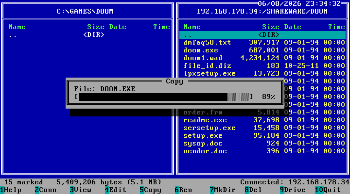

# FTP4DOS

A Norton Commander-style **dual-pane FTP client for MS-DOS** running on any
x86 machine. The left pane shows the local DOS filesystem; the right pane
connects to an FTP server via the
[mTCP](http://www.brutman.com/mTCP/mTCP.html) TCP/IP stack — fully
keyboard-driven in 80×25 text mode.



Download latest release here: <https://github.com/Projanglez/ftp4dos/releases/latest>

## Features

### Panes & navigation

- Two panes, Norton Commander style: local DOS filesystem and remote FTP server (passive mode)
- Per-pane sorting (Alt+F3: name/extension/size/date/time, asc/desc) and pane swap (Ctrl+U)
- **Search / jump-to-name** and **full-screen pane toggle** for long remote names
- **Large remote directories**: 512 entries by default; with **`/EXMEM`** the listing is kept in **XMS/EMS memory** for several thousand files

### File operations

- Copy (F5) and move (F6) in both directions, rename (Alt+F6) — **recursive for whole directory trees**
- Create directories (F7) and **recursive delete** (F8, confirmations show recursive file/directory counts and total size)
- Multiple selection with the **Ins key** (Norton style) for copy/move/delete
- Live transfer telemetry (current/average speed, per-file and batch ETA); pause (P) and cancel (ESC) mid-transfer
- View files with F3 (up to 32 KB; remote files via temp download); edit local text files with F4 (minimal editor)
- File checksums (Alt+F9): CRC32 + MD5 for local and remote files, optionally saved to a file

### File names & character sets

- **Long remote file names** kept in full beyond the 8.3 / 40-column display and used for transfers; **Alt+F2 "Detail"** shows the complete name and size
- **Long local file names (LFN)** where an LFN API is available (Windows 9x DOS, MS-DOS 7.x, or [DOSLFN](http://adoxa.altervista.org/doslfn/))
- **UTF-8 remote file names** (RFC 2640), converted to the active DOS codepage (CP437, CP850/858, CP866) and re-encoded on upload; override with `FTP4DOS_CODEPAGE` in `MTCP.CFG`

### User interface

- Bilingual German/English UI, auto-detected from the DOS country setting (force with `FTP4DOS /L:EN`)
- Locale-aware number/date/time formatting; compact M/G size display for large files

### More features...

- **Site manager** — any number of named connection profiles (host, port, user, password, start directory) in `FTP4DOS.SIT`, via **[Manage...]** in the connect dialog
- **Tunable transfer buffers** via `MTCP.CFG` for maximum throughput on your hardware (see [Performance tuning](#performance-tuning))

## Build requirements

- [Open Watcom C/C++](http://www.openwatcom.org/) (wmake, wpp, wcc, wasm, wlink)
- Windows or DOS host for cross-compilation
- Target: 16-bit real-mode DOS, Large memory model, 8086+

## Building

mTCP is an **external dependency**, included as a **git submodule** of the
official repository <https://github.com/mbbrutman/mTCP>, pinned to the
**2025-01-10** release tag. Clone with submodules and build with Open Watcom:

```sh
git clone --recursive https://github.com/Projanglez/ftp4dos.git
# or, in an existing checkout:
git submodule update --init

wmake          # produces FTP4DOS.EXE
wmake clean    # removes objects and build artifacts
```

- mTCP home page: <http://www.brutman.com/mTCP/mTCP.html>

Note: mTCP is compiled with `-0` (8086), and the application code likewise
uses `-0` (compatible with 8086/286/386+). Details are in `MAKEFILE` and `CLAUDE.md`.

## Running (on the DOS machine)

A packet driver for your network card and an valid mTCP configuration file are required, as well as a valid IP-adress (static or dynamic) via mTCP.

```bat
FTP4DOS.EXE
```

### Command-line parameters

```
FTP4DOS [/L:DE|EN] [/H:HOST] [/P:PORT] [/U:USER] [/W:PASS] [/D:DIR] [/S:ALL|NOPASS|OFF] [/EXMEM[:XMS|EMS]] [/Q] [/MONO|/COLOR]   (or /?)
```

Both `/` and `-` are accepted as the flag prefix. Flags are **case-insensitive**;
values are passed through as-is (username and password are case-sensitive).

| Parameter | Description |
|-----------|-------------|
| `/L:DE` / `/L:EN` | Force German or English UI |
| `/H:HOST` | Connect to HOST automatically on startup |
| `/P:PORT` | Port (default 21) |
| `/U:USER` | Username (default `anonymous`) |
| `/W:PASS` | Password |
| `/D:DIR` | FTP start directory after connect (empty = root) |
| `/S:ALL` | Save connection including password to `FTP4DOS.SAV` (default) |
| `/S:NOPASS` | Save connection but not the password |
| `/S:OFF` | Do not save this connection |
| `/EXMEM` | Store large remote listings in extended/expanded memory (auto: XMS then EMS; force with `/EXMEM:XMS` or `/EXMEM:EMS`) |
| `/Q` | Skip the splash screen |
| `/MONO` | Force monochrome display (MDA/Hercules) |
| `/COLOR` | Force color display (default: auto-detect) |
| `/?` | Show brief help |

### Saved connection

After a successful connection, host/port/username (and optionally the password)
plus the FTP start directory are stored in `FTP4DOS.SAV` next to the EXE and
pre-filled on the next launch. Use `/S:ALL` (default), `/S:NOPASS`, or `/S:OFF`
to control what gets saved; the connect dialog offers the same three choices
interactively.

For more than one server, the **site manager** ([Manage...] in the connect
dialog) keeps any number of named profiles in `FTP4DOS.SIT`.

**Security note:** Stored passwords are lightly obfuscated (XOR + hex), not
encrypted — and FTP transmits passwords in plain text anyway.

## Performance tuning

> **Advanced — totally optional.** FTP4DOS works fine out of the box with
> sensible defaults; only dig into this if you want to squeeze out more
> throughput on your specific hardware.

Transfer buffer sizes have a large impact on throughput, and the optimal
values are hardware-specific (disk speed, CPU, packet driver quality).
FTP4DOS reads the following optional settings from your mTCP configuration
file (`MTCPCFG`):

| Setting | Range | Default | Description |
|---------|-------|---------|-------------|
| `FTP4DOS_TCP_BUFFER` | 512–16384 | 16384 | TCP receive buffer (window) of the data connection |
| `FTP4DOS_FILE_BUFFER` | 512–32768 | 8192 | File I/O buffer: received data is written to disk in blocks of this size (uploads read in the same blocks) |
| `FTP4DOS_CODEPAGE` | 437/850/858/866 | auto | Codepage for UTF-8 file name conversion (default: active DOS codepage) |

The mTCP FTP client settings `FTP_TCP_BUFFER` / `FTP_FILE_BUFFER` are read
as fallbacks, so an already tuned `MTCP.CFG` works as-is; the `FTP4DOS_*`
keys take precedence. Experiment: larger file buffers help most machines
(especially with slow disk I/O), but some setups are faster with small ones.
Example:

```
FTP4DOS_TCP_BUFFER 16384
FTP4DOS_FILE_BUFFER 32768
```

## Key bindings

| Key | Action |
|-----|--------|
| Tab | Switch active pane |
| Ctrl+U | Swap panes left/right (remembered) |
| Ctrl+A | File details (same as Alt+F2) |
| Ctrl+F | Search / jump to name (same as Alt+F7) |
| Ctrl+R | Refresh active pane (same as F9) |
| Arrow keys / PgUp PgDn | Move selection |
| Home / End | Jump to first / last entry |
| Ins | Mark entry (for multi-file copy/delete) |
| * (numpad) | Invert selection |
| + (numpad) | Mark files missing or different in the other pane |
| Enter | Enter directory / view file (same as F3) |
| Backspace | Go to parent directory |
| F1 | Help |
| F2 | FTP connect / disconnect (with site manager) |
| Alt+F2 | Detail: full name + size of the selected entry |
| F3 | View file (local or remote; max 32 KB) |
| Alt+F3 | Sort the active pane (name/extension/size/date/time, asc/desc) |
| F4 | Edit local file (minimal editor, ~32 KB, no undo/search) |
| F5 | Copy (recursive for directories) |
| F6 | Move (copy then delete source; recursive) |
| Alt+F6 | Rename (in place) |
| F7 | Create directory |
| Alt+F7 | Search / jump to the next name with a prefix |
| F8 | Delete (recursive with confirmation) |
| Alt+F8 | Full-screen the active pane |
| F9 | Refresh the active pane |
| Alt+F1 | Switch local drive |
| Alt+F9 | Checksum (CRC32 + MD5) of the selected file, optionally saved to a file |
| F10 | Quit |

## License

This project is licensed under the **GNU General Public License v3.0**
(see [`LICENSE`](LICENSE)). It statically links the mTCP library, which is
also licensed under the GPLv3.

### Third-party code / corresponding source

mTCP © Michael B. Brutman — official home page:
<http://www.brutman.com/mTCP/mTCP.html>

This project builds against the **official mTCP, version 2025-01-10**,
unmodified, referenced as a git submodule of the official repository
<https://github.com/mbbrutman/mTCP> (pinned to the `2025-01-10` release
tag). That exact source, together with the source in this repository,
constitutes the complete corresponding source for any distributed binary
(GPLv3 §6). Published releases include a copy of those mTCP sources as an
additional release asset.

## Disclaimer

This software is provided without any warranty; use at your own risk. See [LICENSE](LICENSE) (GPLv3, §15–16).

## Development note

This software was developed with the help of an AI coding assistant (Claude Code).
